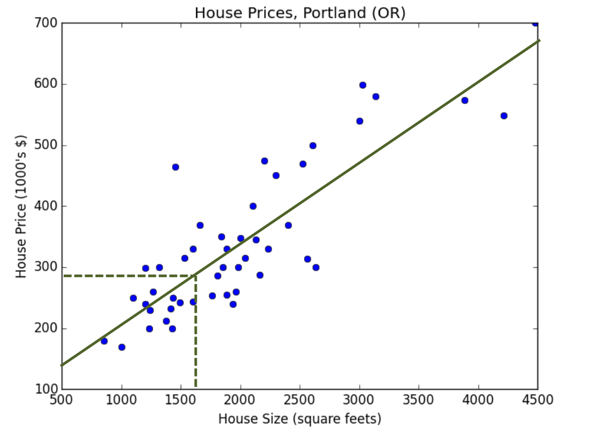
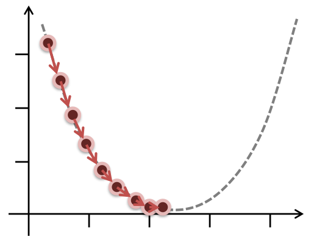
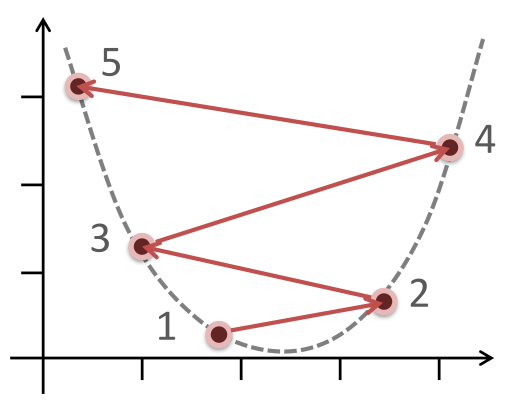

# Introduction

**Pattern recognition** is the automated recognition of patterns and regularities in data. One of the approaches to pattern recognition is machine learning.

**Machine learning** is a scientific study of algorithms that perform specific task without explicit instructions.

We divide machine learning into supervised and unsupervised learning.

**Supervised learning** is a task in which we learn a mapping function from input to output based on a set of example input-output pairs.

**Unsupervised learning** discovers patterns in data without a given example output.

In this course we will forcus on supervised learning. The two most prominent problems which we will study are regression and classification.

**Regression** is a task to predict continous value based on input.
**Classfication** on the other hand is a task to assign each input to an element of a discrete set.

# Linear Regression

It's a way of solving a regression task task where we explicitly assume that output can be estimated as simple linear function of the input. The objective is to find that function.

A good example is a task to estimate the price of the house given it's size.

**Training set** is the set $T = \{(x_i, y_i)\ \in D_x \times D_y \}$ of example input-output pairs  where $x_i$ are the inputs and $y_i$ are outputs.

**Mapping function** is a function $h$ that takes *any* (possibly previously unseen) input $x \in D_x$ and outputs a prediction $h(x) \in D_y$

**Inference** is the step of computing $h(x)$ given x.

We've assumed that $h$ is linear. We thus have a set of two parmas $\theta = \{\alpha,\beta\}$ and can write $h_{\theta}(x) = \alpha x + \beta$.

**Formally the goal of linear regression is to find $\theta$ that minimize $J(h_{\theta}(x), y)$ given some distance function $J$.**

**Cost function** (aka. distance function) the function that measures how much the prediction differs from the ground truth. By far the most popular cost function is **Mean squared error - MSE** defined as $\frac{1}{2m}\sum_{i=0}^m (h_{\theta}(x) - y)^2$ where $m$ is the number of training samples

We try to define our cost functions to be convex, because then it's easy to find a global minimum (which has to exist if the function is strictly convex).

# Gradient descent

**Learning Algorithm** is a way of finding the parameters that minimize the cost function.

The most widely used learning algorithm is **Gradient Descent**. It's high level strategy is as follows:

- Pick starting params $\theta$, and **learning rate** $\lambda$
- repeat the following steps, until the update is really small:
  * Compute the gradient of the cost function with respect to parameters $g = \nabla_{\theta}(J(\theta))$
  * Update $\theta$ by subtracting $\lambda * g$

The basic idea is that the derivative points into the direction of bigger values of cost function. So if we w<!-- TODO more on BatchGD vs SGD and mention MiniBatchGD -->
ill step in the opposit direction we will (hopefully) arrive at a lower value of cost function. The learning rate determines the size of the step.

> Plotting the cost function is a good way to check the sanity of your hyper-parameters (for example learning rate)

## Learning rate

Picking learning rate is sometimes tricky. **Undershooting** occurs when the learning rate is to small. It can cause the gradient descent to have very small updates and never reach optimum:

**Overshooting** is when the learning rate is too big. The gradient descent might never converge:

Apart from that gradient descent has some other problems. There are some extensions to tackle them - most notably Batch Gradient Descent. Instead of computing the update for each of the elements in the training set independently it computes the update for whole dataset. Batch gradient descent is computationally more expensive but ensures we generalize well.

<!-- TODO more on BatchGD vs SGD and mention MiniBatchGD -->

# Multiple feature scenario

What happens when the input is a vector not a scalar?
Let's assume $D_x = \reals^N$. For a given $\vec{x_i} \in \reals^N$ we say that it's $j^{th}$ element $x_{ij}$ is the $j^{th}$ feature of $i^{th}$ input sample. 

Now $\theta = \{ \alpha_i \}_{i=0}^{N}$ and thus $h(x_i) = \alpha_{0} + \sum_{j=1}^N \alpha_i * x_{i,j}$.

Surprisingly the gradient descent still works(!). Just pick starting params and keep subtracting $\nabla J * \lambda$ and all the theory still applies.

## Feature normalization

There is one big problem with gradient descent in multidimensional feature space - if the features have different order of magnitude and one wants to use a single learning rate for all the features then there are big differences in the partial derivatives with respect to different features (aka. gradient has elements with different order of magnitude as well). Thus to big $\lambda$ will be bad (we will overshoot some features) and to small $\lambda$ will also be bad (we will undershoot other features).

To tackle the problem we **normalize** the features i.e. make their orders of magnitude the same.

The easiest way to normalize a set is to divide by the element with the biggest absolute value. This approach is not robust against outliers - if we have 10 inputs in range $x_{ij} \in [1,10]$ and one input $x_{i,j}= 10000$ we will compress range $[1,10]$ possibly loosing some information. 

The most common normalization is the **mean normalization**:
  1) center around zero by subtracting mean of all values
  2) divide by variance

Mean normalized features are not in some predefined range but are roughly in the same *scale*. We have to keep the variance and mean to apply same normalisation to input for inference.

# Polynomial regression

What if we our mapping can't be estimated by a linear function? Well here polynomial regression comes into place.

The basic idea is that we can simply make another $N*(k-1)$ features $x_{i,j,n} = (x_{i,j})^n$ for $n = (1 .. k)$. Suprisingly, again nothing changes in terms of algorithm used - just treat them as other features.

We can further complicate this to include some products for instance $x_{i,j}^2 * x_{i,q}$

# Classification - Logistic Regression

We will start with the easiest case - binary classification. It's a task to label the inputs with two classes.

The easiest approach named logistic regression is to perform regression and then do thresholding - if the predicted value is above some level label the input with class $1$ else label with $0$.

To make our life easier with thresholding we use a sigmoid function. Sigmoid function is defined as $g(x) = \frac{1}{1+e^{-x}}$. What we are interested in is that if we will take a linear function $f: \reals \rightarrow \reals$ then we can take mapping function $h(x) = g(f(x))$ and $h$ has two imoportant properties:
  * $h: \reals \rightarrow [0,1]$
  * and $h$ is monotonic (for linear $f$)

We can thus always pick $\frac12$ as a thresholding value. We may also interpret $h(x)$ as the probability that the input is labeled with the class $1$.

The **decision boundary** is a set of all points where the probabilities of x belonging to two different classes are equal.

## Multiclass case

Softmax is weight-combined sigmoid for many outputs.

