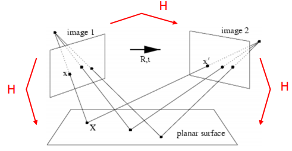
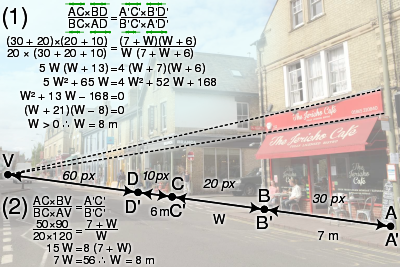
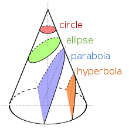
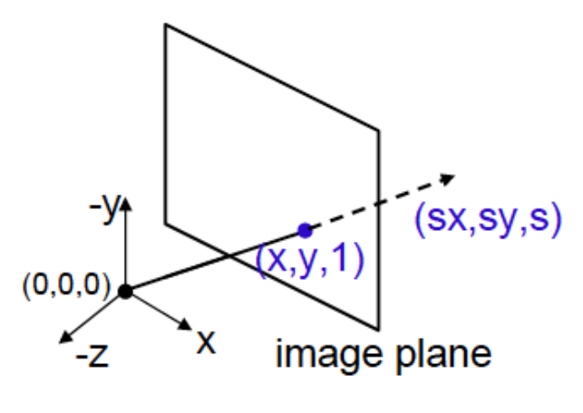
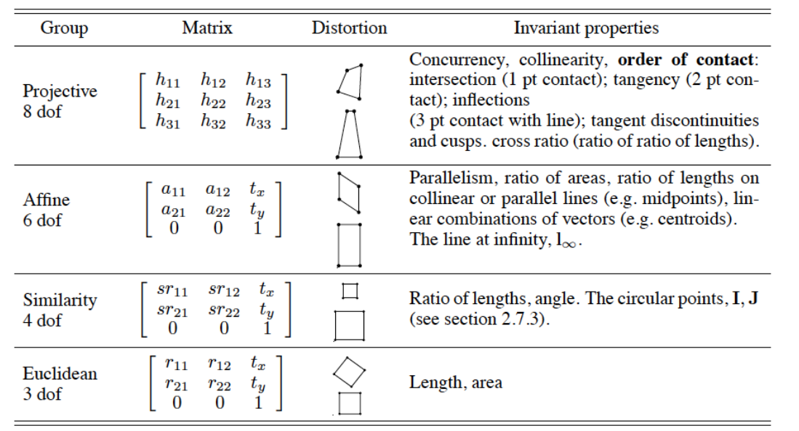

# Introduction to 3D vision

## Applications

### 3D reconstruction

It's by far the most common application of 3D vision. It's goal is to recreate 3D model based on a set of photos.

The high-level pipeline of 3D reconstruction looks like this:

1) Image acquisition
2) Camera calibration
3) Actual 3D reconstruction
4) Texture Mapping

Sometimes we can skip certain steps, for instance cameras may be already calibrated when shooting happend in a 3D vision laboratory, or we might not need textures on our model so we can just discard point 4.

> **Camera calibration** is the process of estimating **intrinsic** and/or **extrinsic** parameters. Intrinsic parameters deal with the camera's internal characteristics, such as, its focal length, skew, distortion, and image center. Extrinsic parameters describe its position and orientation in the world

The pre-calibrated case is also referred to as *Multi-view stereo* or *Shape from X*.

In the non-calibrated case we have two standard problems:
  - [Structure from motion](https://www.youtube.com/watch?v=i7ierVkXYa8) - reconstructing an object from photos
  - [Simultaneous Localization and Mapping](https://www.youtube.com/watch?v=oJt3Ln8H03s) - constructing a map of an unknown environment while simultaneously keeping track of camera location within it

We (humaity) have a crazy amount of cameras and the images are all connected in the Internet, so cool things are now possible. For instance: [Building Rome in a Day](https://grail.cs.washington.edu/rome/) project - a reconstruction of Rome based on publicaly available pictures made by turists.

The project makes a **sparse reconstruction** - it outputs a set of points. But we can also perform a **dense reconstruction** that uses meshes not points.

### Others

* Motion capture:
  - medical, sports, gaming, movies
  - we dont have all the points
  - use of many (32) cameras
* Facial expressions
* Bullet time effect:
  - introduced by movie industry
  - change a point of view while some (fast) events happen (shooting bullet)
* Augmented reality
  - introduce virtual object to real-time footage
  - no 3d reconstruction
  - have to place it right and rotate while the camera is moving
* Match moving:
  - placing virtual 3d object on a 2d scene
  - for instance a 3d spaceship model on a highway scene of some movie

## 3D model representation

We use various rapresentations:

* Point Cloud - a set of 3D points
* (Optionally colored) mesh - a set of (textured) meshes
* Voxels - 3D pixels
* Depth map - grayscale image where brighter is closer

## Math

3D vision largely benefits from:

* Linear algebra
* Projective geometry
* Optimization
* Deep learning

# Projective geometry - 2D case

Pictures are 2D and they usually represent a 3D scene. That's a projection of a 3D space to a 2D plane.

**For now we will only discuss projecting 2D planes in a 3D world to another 2D plane**

> Projective geometry allows to remove the projective distortion of flat objects and build image mosaics (panoramas)

The switching between different planes is also called **projective transformation**.

During the transformation:
- **Angles** are not preserved (and thus shapes are also lost)
- **Lengths** are not preserved (no distance ratio)
- **Colinearity** is preserved (lines are still lines after transformation)
- **Cross ratio** is preserved

## Cross ratio

Given four points $A,B,C,D$ on placed in this order on a  line their cross ratio is defined as $\varkappa(A,B,C,D) = \frac{AC * BD}{AD * BC} = \frac{AC/CB}{BD/AD}$

This enables us to compute real world distance:

In (1) we use the information that $A'B' = 7m$, $D'C' = 6m$, in (2) we use one of these and the vanishing point 
<!-- TODO why can we write (2) equation? What does the vanishing point change? -->

## Definitions

**The vanishing point** is the perspective center, the projection of infinity point on lines.

**Conic sections** are curves formed by the intersection of a cone with planes at different angles. There are four types of conics:

## Projective space

2D projective space is an extension of a 2D euclidean space with a natural represenations for points at infinity. There's one point at infinity for all possible directions of lines.

We will use notation $P^D$ for D-dimensional projective space and $\reals^D$ for D-dimensional euclidean space.  

We will see how these:
* point
* line
* conic

are represented in the projective space.

## Points

In $\reals^2$ each point $p$ is represented by $(x,y)$, the so called *cartesian coordinates*. We represent a point of the plane $R^2$ by a vector in $R^3 \setminus{(0,0,0)}:\quad p = (x,y,z) \neq (0,0,0);\quad p \in P^2$. The vector $(x,y,z)^T$ is refered to as **Homogeneous coordinates**.

**Image plane** is defined as $\{(x,y,1)^T: x,y \in \reals\} \subset P^2$.
Each point in $(x,y) \in \reals^2$ is a **ray** $\{(sx, sy, s)^T: \forall_{s \in \reals}\} \subset P^2$. A ray is also called visual ray, visual direction or view direction.

We say that two points are **equivalent** $p_1 \equiv p_2 \iff$ they lie on the same ray.

### Transforming $\reals^2 \rightarrow P^2$

$v = (x,y)^T \rightarrow p(v) = (x,y,1)^T$

We can now multiply $p(v)$ by a scalar $s \neq 0 \in \reals$

### Transforming $P^2 \rightarrow \reals^2$:

$p(v) = (sx, sy, s)^T \rightarrow v = (x,y)^T$

It doesnt work for when last coordinate is $0$. That's because infinity is not representable in $R^2$

## Lines

In $\reals^2$ a line $l$ passing through a point $p = (x,y)$ has an equation $ax + by + c = 0$

In $P^2$ we define $l = (a,b,c)^T$ (in homogeneous coordinates) and a point $p \in l \iff l^Tx = 0 \lor x^Tl = 0$ 

Lines in $P^2$ can be equivalent: $l \equiv l'$ if $\exist_{k \neq 0}: l' = kl$

Given $l=(a,b,c)^T$ the point at infinity is $p = (-b,a,0)^T$. We can parametrize the points on the line (line is always 1D): $l: \; ax + by + c = 0 \implies l: \; x = \frac{-by}{a} - \frac{c}a \implies l~=~\{(-bt/a -c/a,t,1)\}_{t\in \reals} \equiv \{(-b/a -c/at,1,1/t)\}_{t\in \reals}$

$lim_{t \rightarrow _-^+ \infty}(l)=((-b/a), 1, 0)^T = p \in P^2$. This is a point at infinity of line $l$; $p$ is called the **ideal point** of $l$.

We define **ideal plane** as $\Pi_0 = \{(x,y,0)^T : (x,y) \neq (0,0)\}\subset P^2$

To compute the intersection of two lines $l, l'$ we simply compute their **cross product**. If we do that for parallel lines we will get an ideal point.

**Line at infinity** $l_{\infty} = (0,0,1)^T$ is used for image rectification (removal of projective distortion). It passes through all ideal points.

For $l = (a,b,c)^T: l \times l_{\infty} = (-b, a, 0)^T$

## The duality of points and lines

Funny enough:

$\vec{l} = \vec{x} \times \vec{x'}$ line passing through two points

$\vec{x} = \vec{l} \times \vec{l'}$ the intersection of two lines

Actually, given any valid formula (in $P^2$) the meaning of points and lines can be switched to get another valid formula, as in the example above.

## Conics

Conics are very useful in calibration. Conic equation is $ax^2 + bxy + cy^2 + dx + ey + f = 0$. Consider the following symmetric matrix $C$:

$$C = \begin{bmatrix}
a   & b/2 & d/2 \\
b/2 & c   & e/2 \\
d/2 & e/2 & f
\end{bmatrix}
$$

Given a point $x$

$<Cx,x> = 0 \iff x^tCx = 0 \iff x \in C$

Conic equivalence: $C \equiv C'$ if $\exist_{k \neq 0}: C' = kC$

### Dual conics

$C^*$ defines the conic envelope - equation satisfied by all lines tangent to the primal conic.

Given a line $l$:

$<C^*l,l> = 0 \iff l^tC^*l = 0 \iff l \text{ is tangent to } C$

and if $C$ is invertible:

$C^* = C^{-1}$. Equivalence also holds:
$C^* \equiv C^{*'}$ if $\exist_{k \neq 0}: C^{*'} = kC^*$

### Use of conics:

- Image rectification
- Measuring real angles from image projections
- camera calibration
- auto calibration

## Circular points

$I,J = (1, {+\atop-} i,0)$ circular points - these points:
 - belong to complexification of all real circles
 - are at infinity
 - belong to projective complex space

# Planar Transformations

Types (each builds upon the previous and):
* translation = shifting
* euclidean = translation + rotating
* similarity = euclidean + scale
* affine = similarity + stretching
* projective = affine + projection on some other plane

Given a transformed image, we cannot recover more than similarity - we would need to know what were the original measurments. In similarity distance ratio holds so it's still a lot.

## Representation

We will represent transformations with the **tansformation matrix** $H \in R^{3,3}$. Given $H$ and a point $x \in P^2$ we can compute the transformed $x' = Hx$.

## Translation

The translation by $\vec{t} = (x,y)$ is represented by:

$$\begin{pmatrix}
I & \vec{t} \\
\vec{0}^T & 1
\end{pmatrix} = \begin{pmatrix}
1 & 0 & x \\
0 & 1 & y \\
0 & 0 & 1 
\end{pmatrix}$$

From now on we will stick with the smaller representation.

The **degree of freedom** for translation is $2$: one for each element of $\vec{t}$.

## Euclidean

The rotation by $\theta$ degrees in $\reals^2$ can be represented by $R = \begin{bmatrix}\cos\theta & -\sin\theta \\ \sin\theta & \cos\theta \end{bmatrix}$. The euclidean transform (rotating by $\theta$ and translating by $\vec{t}$) in $P^2$ can be represented as:

$$H = \begin{pmatrix}
R         & \vec{t} \\
\vec{0}^T & 1
\end{pmatrix}$$

Euclideans degree of freedom is $3$: $2$ for translation and one for rotation.

## Similarity

Similarity adds the scale factor $s$ to euclidean. It's represented as:

$$H = \begin{pmatrix}
sR        & \vec{t} \\
\vec{0}^T & 1
\end{pmatrix}$$

It's degree of freedom is $4$: $3$ for euclidean and $1$ for scale factor.

## Affine

Affinity scaling with a different factor in two dimensions.
Let $A$ be a non-singular $2 \times 2$ matrix (and let $\vec{t}$ be a translation vector). Then

$$H = \begin{pmatrix}
A         & \vec{t} \\
\vec{0}^T & 1
\end{pmatrix}$$

If $det(A) \gt 0$ the transform $H$ is orientation preserving (not reflected, and therefore the vertices of a shape $ABCD..$ will preserve order).

Matrix $A$ can be decomposed using SVD:

$A = UDV^T = UV^T(VDV^T) = R_\gamma R_{-\theta}DR_\theta$

Affinity has $6$ degrees of freedom: $2$ for each of:
- $\gamma, \theta$ (rotations)
- $D$ (scaling factors)
- $\vec{t}$ (translation)

It preserves parallel lines, ratios of parallel lenghts, ratio of areas, line at infinity $l_{\infty}$ (preserves =  keeps being at infinity).

## Projective

Affine transform with projecting on some other plane.

$$H_p = \begin{bmatrix}
h_{1,1} & h_{1,2} & h_{1,3} \\
h_{2,1} & h_{2,2} & h_{2,3} \\
h_{3,1} & h_{3,2} & h_{3,3}
\end{bmatrix}$$

Projective transformation $H_p$ is called a 2D **homography**, it has to be non-singular.

It has $8$ degress of freedom: we discount the scale factor because we can just divide the whole matrix by ($h_{3,3}$) and it becomes $1$. And *dividing by a scalar doesn't change the transformation*. So we can always fix one element.

<!-- TODO Is that ("dividing by a scalar doesn't change the transformation") sentence really true? -->

Invariants:
  * concurrency
  * colinearity
  * order of contact
  * cross ratio

## Overall

.pdf)

# Homographies

Similarity transformations are also affine and affine transformations are projective transfromations. Projective transformations are also called **homographies**.

Projective transformations of:
  * points  $x' = Hx$
  * line $l' = H^{-T}l$
  * conics $C' = H^{-T}CH^{-1}$
  * dual conic $C^{*'} = H C^*H^T$

A homography relates two images:
  * of the same plane in the 3D scene
  * taken with a camera rotating about its centre
  * taken with the same static camera varying its focal length
  * the whole scene is far away from the camera

For instance shade of a house is a projective transformation of a house with light source as a center.

<!-- TODO maybe we've already have enough of applications and we can delete that -->

Aplications (once again):
  * Panorama (Image mosaic)
  * Logo detection - canonical view vs some projective transform
  * Logo insertion - find the homography and then apply it to another logo
  * Sports field localization
  * Augmented reality
  * Multi image fusion - take many photos and make one good
  * Image rectification
  * New view synthesis
  * Depth estimation
  * Optical flow
  * Video inpainting
  * Camera motion compensation

# Notes in progress - warning

> Beyond this point I haven't yet restructured the notes, they may contain errors and they are just a set of loose sentences written during the lecture.

# Affine and metric rectification

* The image capture of the camera is described with a linear transformation.
* The intersection of two lines and the line that passes through two points is a linear operation
* Points at infinity have a natural representation.

**Ray** is a tuple (sx,sy,s). all points on the ray are equivalent $(x,y,1) \equiv (sx,sy,s)$

**line at infinity** $l_{\infty} = (0,0,1)^T$  $<l_{\infty},x> = 0 \text{for } x \in \Pi_0$  

## Removing projective distortion

$\vec{t}$ is the translation vector, v is ...

Affine vs projective:

H maps an ideal point to a finite point if H is projective and not affinity. If H is affinity the ideal point remains ideal.

$H$ is affinity $\iff l_{\infty}$ is a fixed line under $H$.

$H$ can be decomposed into three $H_1, H_2, H3$

How to use these results?

If we know $H$ the decompostion can be easily computed. Unfortunately we generally don't know $H$ - we only have an image of a 2D plane in a 3D world.

We are going to be exploiting the fact that affinity keeps line at infty at infty.

For the view to become an affinity transformation of the original scene we have to put a line at infinty to infinity.

In order to do this we compute the vanishing point and vanishing line. Vanishing line l of a plane is the image of its line in infinity. The vanishing line is often not in the image but it is on the plane of the image. And that's enough.

After computing the line at infinity we just need to find a transformation to put this line to $(0,0,1)^T$ and we have an affine transformation of the original image.

### Metric rectification

We now have an image that is an affine transformation of the original 2D scene. We want to recover the similarity transform.

stratified metric rectification method

Since affine transformation disturbes angles we will be working with them.

Remember that:
$a \cdot b = ||a|| * ||b|| * cos(\theta)$

We will use a dual conic $\Omega_{\infty} = IJ^T + JI^T$ 
circles points are fixed in projective but aren't in affinity

if two lines are orthogonal then the numerator is $0$ which is awesome for us.

We will detect some angles in the image *assuming* they are 90 degrees and compute a homography that puts them back to being 90 degrees.

* $H$ is a similarity $\iff H\Omega_{\infty}H^T = \Omega_{\infty}$

The algorithm:

<!-- TODO fill the algorithm -->

Note: In order for this to work we **need** prior knowledge about orthogonal lines in the original image

## Doing it in one step

If we know more pairs of orthogonal lines we can construct a linear system of equations and compute the transformation mattrix and transform the image in one step.

# Homography computation

(Automatic computation of homography)

The method used to compute the homography is extremely important because it is used many more times in more advanced 3D vision.

* DLT - the basic (algebraic)
* Robust normalized DLT (algebraic)
* Gold-Standard algorithm (geometric)

## DLT
In a practical situation we have two images of the same scene from differents perspectives. We compute corresponting points on the two images $(x_i, x'_i)$.

Because homography has eight degrees of freedom we need at least 4 points in general position to compute $H$.

We search for H such that $Hx_i = x'_i$

If we exploit it 3 times we will get linear dependent so we just write two equations

$(h1,h2,h3)^T \in \reals^{9,1}$ is a matrix A stacked to a column form. h1 is the first row of A, h2 the second etc.

so vectors $x,x'$ should be parallel (we again discount scale)
Watch out for unstable computations

If $n \gt 4$ it becomes a regression problem -> we got noisy data and want to minimize error via SVD.

The algorithm:
....

### Normalized dlt 

Basic DLT is very dependent on the configuration of units, coordinate frames of the image, not invariant to rotation.

In order to solve this we normalize the values. We move the coordinate frame to the known coordinate frame. The algorithms becomes stable and behaves a lot better in real world.

## Gold standard algorithm

Geometric:
Let's assume that the points are noisy ($x, x'$ are corrupted noisy)

RANSAC:

Basic idea:
  * Get 4 random samples and do DLT
  * Do it many times
  * Until:
    * There is one H that gives lower error than others
    * You are tired of computing. Use voting to determine the outcome

    

# References & Thanks

## Images

module-4/assets/visualray.png - I found it in a presentation that only mentioned it's from S. Seitz.

